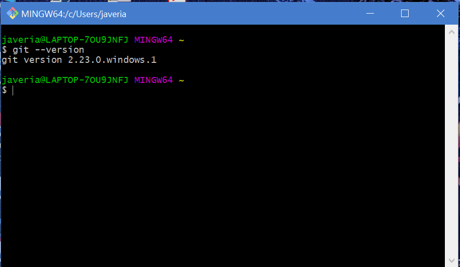
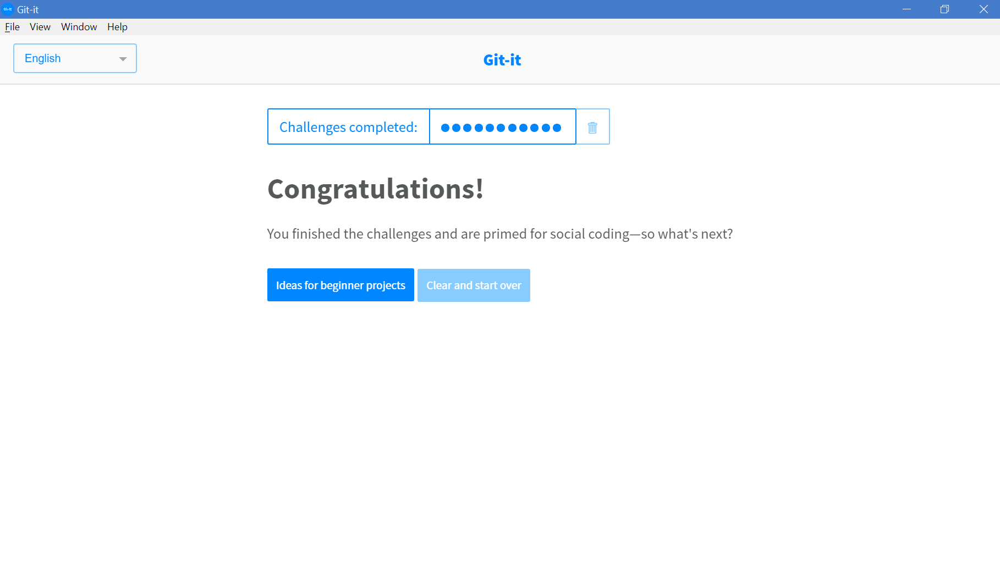

# Sayeeda Tasmia Mohammed Nasir

My Picture

---

## Where Am I from 
 I am from Bangalore, India.

Bangalore is the capital of Karnataka, located in the southern India. It is also known as “Silicon Valley of India” because of its role as the nation’s leading information technology (IT) exporter. Bangalore usually enjoys a more moderate climate throughout the year, although occasional heat waves can make summer somewhat uncomfortable. Kannada is the official language of Bangalore, but the city is multi-cultural. Bangalore is known as the "Garden City of India" because of its greenery, broad streets and the presence of many public parks, such as Lal Bagh and Cubbon Park. 

## Background

---

I have been working soon after my undergrad in 2012 and my last designation back in India was ‘Senior Software Engineer’. I am basically a Java Developer but have also worked on front end technology like AngularJS. I am an OCJP certified with 93 percentiles. I have 6 years of work experience and worked on technologies like Java, J2EE, Spring, Struts, JavaScript, JQuery, AngularJs and lot more.

---

## Badges

## Additional Info
 
I sing, sketch and crochet. I also know to speak many regional languages of India like Kannada, Tamil, Gujarati, Marathi.
